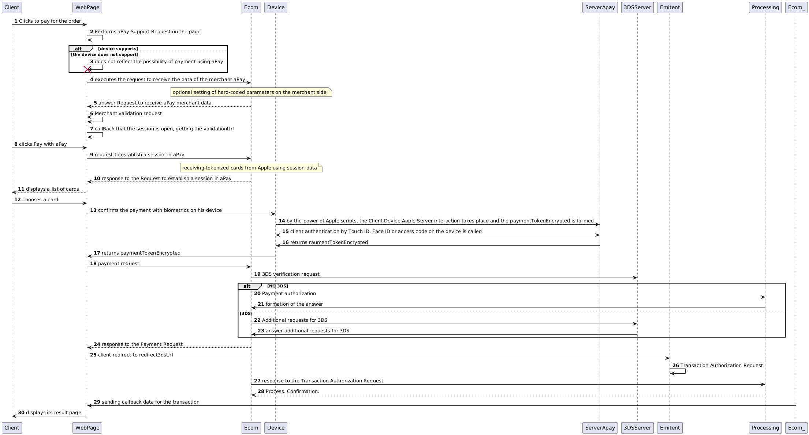

# ApplePay encrypted

<figure><figcaption></figcaption></figure>

1. The client clicks the "Pay for Order" button on the website or application.
2. The WebPage executes the **Apple Pay Support Request** script to check whether Apple Pay is supported on the current page.
3. If the client’s device does not support Apple Pay, the client will not be able to use this payment method, and the request will be rejected.
4. If Apple Pay is supported, the WebPage sends an optional **Merchant Data Request** to Apple Pay. Merchant-side hard-coded Apple Pay data can be used.
5. The WebPage executes the **Merchant Validation** script via Apple Pay to confirm the merchant data.
6. Apple Pay returns a callback containing the `validationUrl` parameter.
7. The client clicks the **Pay with Apple Pay** button to confirm the selection of this payment method.
8. A session with Apple Pay is established, and the client’s device is ready to interact with Apple Pay.
9. In response to session establishment, Apple transmits tokenized card data.
10. The client is presented with a list of available cards stored on the device for payment.
11. The client selects a card for payment.
12. The client’s device script interacts with Apple’s server to obtain the encrypted `paymentToken`.
13. Client authentication is performed via biometrics or password.
14. Apple generates the `paymentToken` and transmits it to the WebPage for further processing.
15. The WebPage sends a **Payment Processing Request** using the received token.
16. If **3D Secure (3DS) verification** is required, the 3DS process is initiated. If 3DS is not required, the transaction proceeds without it.
17. Non-3DS Flow:

* The payment is authorized.
* A response to the **Payment Processing Request** is generated.

18. 3DS Flow:

* Additional verification is performed via 3DS.
* Upon verification completion, a response to the **Payment Processing Request** is returned, including the `redirect3dsUrl` parameter.
* The WebPage redirects the client to the `redirect3dsUrl` page for 3DS authentication.
* The client confirms the transaction via 3DS.
* The transaction is authorized.

19. A callback is sent to the merchant at the specified `notificationUrl`, containing transaction details.
20. The client is redirected to a **Result Page**, confirming the payment completion.

\
