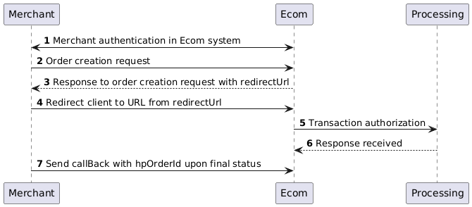

# Payment methods HPP

With the HPP API, you can easily accept payments from bank cards (credit and debit) for goods or services in your application or on your website. \
Our API also provides the ability to track the status of transactions in real time and receive automatic notifications (callBack) about the completion of payments, which will help you ensure a smooth payment acceptance process.

<figure><figcaption></figcaption></figure>

1. Prepare a request to create an order according to the instructions
2. Redirect the customer to our payment page (redirectUrl)
3. Wait for a callback or perform a status check request.
