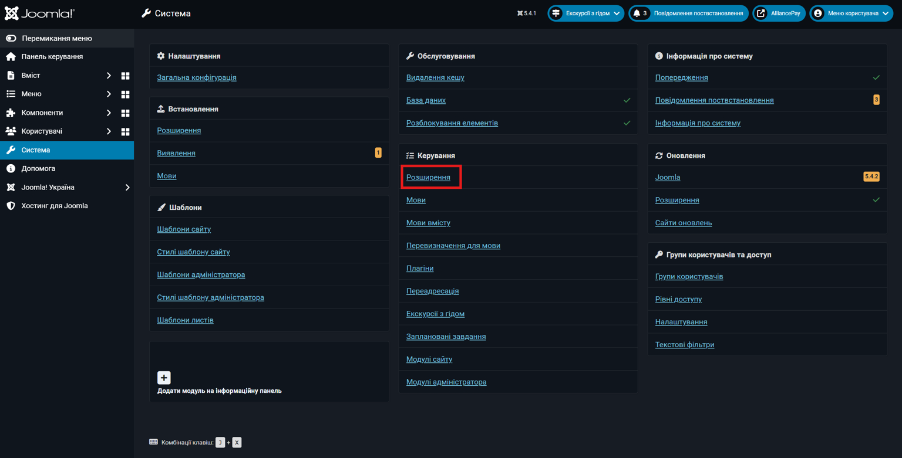

# Installation instructions









### Go to extensions management

Follow the path "System" - in the "Management" section, select the "Extensions" section from the list

<figure><figcaption></figcaption></figure>



### Installing the extension

In the Open window, you need to select the "Install extensions" button

<figure><figcaption></figcaption></figure>

Then, select the "Download package file" tab.

<figure><figcaption></figcaption></figure>

To download, you just need to click on the "Choose file on your computer" button and select the previously downloaded file.

After that, the message "Plugin installed successfully" should appear

<figure><figcaption></figcaption></figure>



### Enabling the plugin

You need to go back to the extension management by clicking on the "Extension Management" button

Where you need to use the search to find the plugin, then select it and in the "Actions" you need to click on the "Enable" button

<figure><figcaption></figcaption></figure>


As a result, the plugin should appear in the settings list when adding a payment method in VirtueMart.

.png>)



